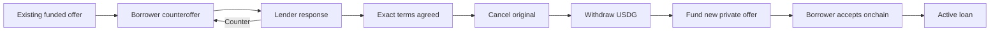

# Counteroffers on existing P2P offers

Draft implementation plan · 8 September 2026. Research and planning only; no application or contract changes deployed by this task.

## Recommendation

Add a two-party negotiation thread to each eligible, unaccepted P2P offer. The borrower and lender exchange exact terms, agree to one version, then use the existing contracts to replace the original offer with a funded private offer for that borrower.

This works with the current contracts as a sequence of transactions. It cannot atomically edit or replace an offer, reserve its funding by an offchain signature, or prevent direct acceptance of an open public offer. A one-transaction replacement would require separately designed contract functionality and is outside this plan.

Use the existing P2P product, server, wallet client, registry, transaction recovery and design system. Build on the request system's signing and verification patterns, but do not force bilateral negotiation into its current flat lender-proposal array.

## What was verified

- At **09:42:24 UTC on 8 September**, the authenticated production request API returned HTTP 200, schema 1, canonical origin `https://turret.capital`, and one request. The running service had persistent request storage with one record. The production registry contained 19 current V3 markets and 20 retained markets. Deployment `3c19ff71-01d8-4cfa-8c17-67d33aa8e519` was `SUCCESS` and unchanged across the observation. This is a read-only availability check, not a production loan transaction test.
- The combined release record confirms that borrower requests, lender proposals and verified funded-offer links shipped on 7 September. Earlier documents saying these features or V3 are deferred/pending are historical, not current availability evidence.
- Fresh baseline checks passed: **14 server/integration tests**, including an actual disposable-Anvil request → proposal → agreement → funding → acceptance lifecycle, and **9 client tests**. No production listings, wallet transactions or notifications were created.
- Request server, request client, signing module, transaction client and public-offer browser match the frozen V3 frontend source examined. The current borrower-request component also includes later valuation and market-prefill changes; preserve those when implementing. These comparisons do not establish that the entire dirty checkout is a production release source.

Evidence: [production observation](../output/p2p-counteroffers-plan-20260908/production-observation.json), [source comparison](../output/p2p-counteroffers-plan-20260908/source-observation.json), [server/integration test log](../output/p2p-counteroffers-plan-20260908/request-baseline-tests.log), [client test log](../output/p2p-counteroffers-plan-20260908/client-baseline-tests.log).

## Existing behavior and gaps

| Area | Current implementation | Consequence for counteroffers |
| --- | --- | --- |
| Requests | A borrower publishes a public request; lenders append proposals; the borrower selects a proposal. | No source offer ID, bilateral turn history or borrower response with changed terms. |
| Agreement | Agreement is informational. The lender can fund an available proposal without prior borrower agreement. | The new guided replacement flow must require agreement to the exact latest terms; do not reuse the existing funding check unchanged. |
| Concurrency | Every proposal increments the entire request's revision. | Independent borrowers need separate thread revisions; selecting a replacement also needs an offer-level compare-and-set. |
| Signatures | Canonical human-readable envelope, site/chain/market/wallet binding, five-minute validity, nonce and revision checks. | Reuse the protections with a distinct negotiation message/version and exact source-offer binding. |
| Stored evidence | Current JSON retains normalized requests/proposals and temporary replay records, not a permanent history of signed envelopes. | Store each new negotiation event and its signature. Do not describe existing V1 records as a cryptographically replayable negotiation log. |
| Visibility | Request GETs are public to site visitors; an account filter is not authentication. | Participant-only threads require wallet-authenticated reads, including counts, previews and history. |
| Custody | V3 creates a separate immutable vault for each offer. `createOffer` pulls USDG from the lender's wallet. | New terms require a new funded offer. Existing withdrawal credits cannot directly fund `createOffer`. |
| Cancellation | `cancelOffer` records a USDG withdrawal credit. `withdrawCredit` transfers it separately. | Cancellation alone must never be shown as money returned to the wallet. |
| Public availability | Anyone eligible can accept an open public offer before cancellation confirms. | Negotiation and agreement do not reserve the source offer. |
| Recovery | Client verifies exact transactions, replacement receipts and canonical blocks, and persists pending operations. | Reuse it for every transaction; add a durable replacement workflow that survives reload and uncertain outcomes. |
| Alerts | Existing P2P alerts consume onchain loan/extension events. | They do not automatically notify about website counteroffers. A separate event path would be needed. |
| Accepted loans | V3 supports mutually agreed deadline extensions, without increasing interest. | Keep that existing flow. Counteroffers do not rewrite active principal, collateral or interest. |

## Scope and product defaults

1. Support every **current registered V3 collateral market**, using registry identities and decimals rather than an asset-specific branch. Include public offers and private offers addressed to the connected borrower. Retained V1/V2 agreements remain manageable but do not gain new negotiation entry points.
2. Borrowers can propose principal, collateral quantity, fixed USDG interest, duration in whole days and the eventual offer's acceptance expiry. Both parties can counter repeatedly. The market, tokens and parties remain fixed within a thread. Changing assets starts elsewhere.
3. One active thread per source offer and borrower. A lender can receive threads from several borrowers; each borrower sees their own conversation. Do not imply that different wallet addresses establish different people.
4. **Proposed visibility: participants only.** A preference question is pending. This is application-level privacy from other visitors, not end-to-end encryption or confidentiality from the operator. A subsequently funded private offer still has public onchain terms. Existing public borrower requests remain public.
5. Structured financial proposals, decline, withdraw, close and agreement are sufficient for the first version. Free-text chat, attachments, automatic bargaining and social messaging are outside the first release.
6. The default completion path replaces the original offer. Do not silently leave it funded while creating an additional loan commitment. An optional “keep both offers” flow can be specified later.
7. No new platform fee, economic principal ceiling, changed grace period, partial fill, partial repayment, refinancing or automatic term extension.

## Borrower and lender experience

**Entry:** add **Make counteroffer** in offer details and as a secondary marketplace action. Preserve **Review loan** and acceptance at the original terms. For the lender, show **View negotiations** on their own offer. A disconnected visitor can inspect the original offer; sending or reading a restricted thread requires wallet verification.

**Compose:** prefill the source terms. Show a compact comparison of “Listed terms” and “Your proposal”: USDG received, collateral, fixed interest, total repayment, duration and offer acceptance expiry. Show changes in words/values, not color alone. Display fixed interest for the whole loan; any annualized equivalent stays secondary.

**Thread:** original listing summary at the top, latest proposal and available action next, older turns collapsed beneath. Each turn identifies its author, time and status. The recipient can **Agree to terms**, **Counter**, or **Decline**. The author can withdraw the live proposal. There is no acceptance of an older or self-authored version.

**Discovery:** add a compact Negotiations view within P2P's existing navigation, with “Your turn,” “Waiting,” “Agreed / finishing,” and history. Keep it separate from active debts and funded capital. Use a private unread count and stable thread links; opening the page after a reload restores the selected thread.

**Agreement:** show “Terms agreed — loan not opened.” The lender proceeds to **Replace offer**. The borrower sees actual progress and then **Review funded loan**. The latter is the existing collateral-approval and onchain-acceptance flow with a final exact-term comparison.

Either party may author the final counteroffer; the other agrees. The diagram shows the typical entry sequence, not a lender-only agreement rule. Each financial step remains subject to its own wallet review and receipt.

**Presentation:** preserve warm paper, charcoal, existing typography, 48px controls, wallet avatars and valuation components. Use an inline workspace rather than nested full-size proposal cards. Desktop comparisons use columns; mobile places old/new values together per field. Keep the latest proposal and action before the history. Errors stay beside the relevant action; failed reads show unavailable/stale state, not zero balances. Do not infer a liquidation threshold from a P2P price estimate.

Proposed key copy:

- “A counteroffer does not reserve this loan. The original offer can still be accepted until its cancellation confirms.”
- “Agreeing to terms does not move funds or open a loan.”
- “Original offer cancelled. Withdraw its USDG to continue.”
- “New offer funded. Only the named borrower can accept it; the terms are visible on-chain.”

## Agreement and replacement state model

Keep negotiation state, replacement progress and verified onchain offer state separate. A single `accepted` flag cannot represent all three.

| Transition | Required behavior |
| --- | --- |
| Open thread → counter | New immutable proposal references the current thread revision and prior proposal; supersedes the former live proposal. Only the addressed counterparty can respond. |
| Latest proposal → agreed | The other party signs the exact proposal hash/version. A transaction in the negotiation store selects this thread against the source offer's selection revision. At most one guided replacement is selected per original offer. |
| Agreed → replacement started | The lender signs an explicit replacement intent binding source offer, thread, agreed version and expected private recipient. Recheck current agreement, source state and market health. |
| Source cancellation → USDG recovery | Wait for and verify canonical cancellation/expiry receipts, then read this source vault's actual withdrawable credit. Reuse exact credit withdrawal; never automatically write off a shortfall. |
| Recovery → funding | Recheck agreement, identity, amounts, wallet balance, source cancellation and replacement journal. Approve as needed, then create the exact private offer. Recheck negotiation preconditions after approval, before the loan transaction. |
| Funding → linked | Derive offer ID from the confirmed `OfferCreated` event for the exact verified transaction. Verify parties, market identity, token pair, vault funding and every agreed term at a canonical block. Save the link idempotently. |
| Linked → loan active | Borrower reviews and accepts onchain. Only the confirmed onchain acceptance marks a loan active and adds it to obligations. |

The store selection coordinates website workflows; it is not an onchain reservation. Direct contract calls and other clients remain governed by the existing contracts.

### Replacement transactions and recoverability

With current V3 contracts, the lender performs:

1. Cancel the original open offer, or finalize its expiry if applicable.
2. Withdraw the available USDG credit from that offer's vault to their wallet.
3. Approve the required USDG allowance if necessary, then fund the agreed private offer.

The borrower then approves collateral if necessary and accepts the private offer. The current client can clear an existing nonmatching allowance before setting the exact amount, so approvals can add **up to two transactions per token**. Do not advertise a guaranteed one-click or one-signature completion. Offchain proposal signatures also require wallet interaction, although they do not pay network gas.

A larger negotiated principal needs additional wallet USDG. A smaller principal leaves excess recovered USDG in the lender's wallet. Recovery shortages, frozen transfers, network fees or declined signatures must produce explicit next steps; no automatic top-up, writeoff or replacement of existing obligations.

Persist one replacement intent with the selected agreement, source/candidate IDs, exact expected calls, verified receipts and pending transaction references. Resume from actual chain state after reload. Obtain each transaction hash from the client and recover it if the browser disappears before linking. Do not discover the replacement solely by comparing a paginated before/after offer list: the current funding screen uses that heuristic, which is insufficient for the new multi-step flow.

If the final link save fails, show “Offer funded; linking pending” with its verified direct link. Reconciliation or manual verified linking must not call `createOffer` again. An unknown or replaced wallet transaction must be resolved before releasing the intent or offering another funding action, including in another tab/device.

### Competing events and expiry

- **Another borrower accepts the original first:** stop replacement. The original loan remains valid. Show that the source offer is unavailable and close its pending negotiations; never proceed to cancel an active loan or automatically fund a second commitment.
- **Counter vs agreement at the same revision:** exactly one succeeds. Refresh and require a fresh signature for the other; never silently apply new terms to an old acceptance.
- **Two borrowers reach agreement:** the offer-level selection transaction admits one guided replacement. Other threads display selection status without exposing the selected borrower's private terms.
- **Planned cancellation:** closes the original to new borrowing but keeps the selected replacement resumable. Competing threads become unavailable. Do not let a generic source-cancelled handler destroy the selected workflow.
- **Unrelated cancellation before selection:** close dependent negotiations. Do not silently adopt unrelated manual actions as a replacement intent.
- **Agreement withdrawn during wallet confirmation:** recheck before sending, but acknowledge that an already submitted transaction cannot be revoked by the server. Reconcile any actual funded private offer and expose its normal cancellation/acceptance paths; never misreport it as not funded.
- **Source expiry:** stop new negotiation/agreements at the source expiry. A previously agreed, journaled replacement may continue after verified source expiry/cancellation while its signed replacement deadlines remain valid. Other expired conversations close. No automatic extension of a signed deadline.
- **Reorg or stale/unavailable source reads:** suspend dependent progress and revalidate recorded blocks/receipts. Do not infer “no offer” or free the replacement slot while a transaction outcome is unresolved.
- **Replacement expires or is cancelled:** retain its history and recovery link. Any retry is a new explicit signed agreement/attempt after prior outcomes are reconciled, not silent reuse of an expired proposal.

Keep three clocks distinct: action signature validity (five minutes), proposal/agreement response deadline, and the new funded offer's acceptance expiry. Loan duration starts only when acceptance confirms; the 24-hour grace period remains contractual. Use server/chain time for enforcement and show timezone labels in the UI.

For the first proposal, suggest a response deadline of the earlier of 24 hours from now or the source expiry, and prefill the new offer's acceptance expiry from the original. Both are explicit editable fields, with the response deadline before the proposed offer expiry and source expiry. Signing agreement before that response deadline locks the exact selected terms; completing replacement must still meet the signed offer expiry. Any extension of those deadlines requires a fresh counter and consent. Do not accidentally import the V1 request board's 30-day listing rule as an undisclosed contract limit.

## Backend, signatures and storage

Introduce `/api/p2p/negotiations` alongside the existing `/api/p2p/requests`. Preserve the V1 endpoint, JSON records and signing format. Reuse validated amount handling, registry lookup, wallet verification and canonical offer verification through narrowly scoped shared modules, with V1 regression tests.

New records need:

- **Source offer:** chain, registered manager, decimal-string offer ID, immutable term digest, lender, permitted borrower/public status, observed block number/hash and timestamp. Obtain identities from verified chain reads, never caller-supplied RPC URLs or arbitrary contract addresses.
- **Thread:** UUID, borrower/lender, source key, revision, current proposal, negotiated state and private activity timestamps.
- **Proposal/event:** immutable ID, author/recipient, parent proposal, exact raw-unit terms, response deadline, action envelope/signature, signer verification context and recorded timestamp.
- **Agreement:** exact proposal hash, both parties' signed actions, validity and revocation state. No acceptance of a mutable “latest terms” object.
- **Replacement intent:** source-level selection revision, chosen agreement, step journal, pending/confirmed transaction identities, canonical evidence, and unique linked replacement key.

Use a distinct `Turret P2P offer negotiation` message/domain and version; bind origin, chain, manager, source ID/digest, parties, thread/proposal IDs, action, revision, nonce, issue time, signature expiry and exact terms. Verify EOA and supported contract-wallet signatures. Recheck account and network around every signing operation. Persist signed evidence rather than just its interpretation.

**Recommended storage:** a dedicated SQLite database under the existing frontend's persistent volume, using the pinned Node runtime and the project's existing SQLite patterns. No additional Railway service is needed. Transactions cover the event append, nonce/idempotency result, thread revision and source-offer selection together. Give threads and events separate paginated tables; do not repeatedly rewrite all history or inherit the current board's lifetime 10,000-record ceiling. Start with one supported writer deployment and tested backup/restore; horizontal scaling requires a separately qualified shared store.

Use configurable, visible anti-spam and payload controls, unique active source/borrower threads, bounded response pages and indexed lookups. Operational limits must not become a hidden loan-count or principal ceiling. Test busy/capacity responses and history access explicitly. Never prune unresolved funding evidence or unexpired replay protection to create capacity.

Idempotent retries of the same accepted signed action return its original result to the authorized caller without executing again. Reuse of the nonce with a different payload is rejected. Timeouts must not lead the client to invent a new action before checking the original result.

For participant-only visibility, add a wallet challenge/session for reads with origin/chain binding, expiry, replay protection and contract-wallet support. Authorization must cover every thread endpoint, pagination, count, preview, export and error response. Never trust an `account` query parameter or the website's shared password as proof of wallet ownership. Keep private responses `private, no-store`, restrict logs and clear private state on wallet changes. Notification consent/signatures must not be repurposed as loan consent.

Avoid holding database write locks during RPC or signature verification. Fetch bounded canonical evidence first, then compare current revisions and persist atomically; recheck time after delays. RPC outages may block new agreement/funding verification, but must not block access to known loans or local offchain withdrawal/closure of proposals once the caller is verified.

## Notifications

The first release must make incoming counters, agreement and resumable funding visible in an in-app inbox, with bounded polling while visible, explicit stale/loading errors and unread state. Existing onchain alerts continue unchanged.

Email/Telegram negotiation updates are a follow-up unless explicitly included. They require a durable idempotent event outbox after a committed negotiation change, a verified service-to-service ingestion path, participant and consent checks, delivery retries and stale-event suppression. Current onchain monitoring cannot discover these events. No notification should suggest that agreement has opened a loan. Do not subscribe users or send messages as part of this planning task.

## Implementation sequence

1. **Freeze the behavioral contract.** Confirm visibility; approve source-replacement semantics, distinct expiries and state/permission table. Capture the then-current live source/registry baseline. Add this feature to the current functional documentation without overwriting historical release evidence.
2. **Implement negotiation storage and API.** Separate V2 records, authenticated reads if private, canonical source verification, signatures, thread history, source selection and idempotency. Preserve V1 request behavior and data.
3. **Build the compact negotiation UI.** Offer entry points, exact before/after terms, bilateral actions, inbox, deep links and refresh/error states. Borrower and lender identities remain explicit.
4. **Build guided replacement and recovery.** Reuse exact existing contract calls and transaction verification, add after-approval preflights, receipt-derived IDs and a durable intent journal. Preserve all existing repayment, extension and withdrawal paths.
5. **Validate in isolation.** Execute the race/recovery matrix below, then browser and actual-token fork coverage against all current V3 collateral markets. Produce a release artifact pinned to the current frontend baseline, not a deployment of the dirty workspace.
6. **Release the frontend/server change.** Back up existing request data and the new database; verify volume mount, supported writer count, schema and rollback compatibility. Deploy a disabled-new-entry capability first, smoke-test reads and recovery, then enable new negotiations after checks. Disabling new negotiations must retain history, pending replacement recovery and normal contract management.

## Acceptance tests and release gates

| Area | Required checks |
| --- | --- |
| Two-way negotiation | Borrower counters a public offer; lender counters; borrower changes terms again; lender agrees. Reverse recipient roles. Private offers reject unrelated wallets. Exact numeric precision, zero interest and supported date ranges. |
| Permissions/signatures | Forgery, changed amounts/recipient/source, wrong origin/chain/manager, replay, self-acceptance, stale proposal/revision, expired signatures after queue delays, EOA/contract-wallet behavior and wallet switches. |
| Privacy | Unauthenticated and third-party GET/list/count/export/ID guesses cannot reveal terms or identities. Shared site access alone cannot read a private thread. Cached responses and wallet switches cannot leak prior data. |
| Selection/races | Two borrowers, multiple tabs and duplicate clicks; source accepted/cancelled/expired while negotiating; simultaneous counter/agreement; planned cancellation differs from unrelated cancellation; reorg during verification. |
| Real replacement | Fund original, negotiate, cancel, withdraw, fund exact private replacement, bind, accept, repay and recover collateral. Verify balances at each step and that principal is never represented as backing two offers. Test larger and smaller negotiated principal. |
| Wallet interruptions | Reject or close at each signature/approval/transaction, reset-then-set approvals, reload, repriced/cancelled/replaced transaction, failed balance refresh, unresolved nonce, and confirmed funding with failed link save. Resume without duplicate funding. |
| Funds and health | Insufficient wallet USDG, collateral or gas; source vault shortfall; token restrictions; paused new loans. No implicit writeoff. Recovery remains accessible when new funding is blocked. |
| Persistence | Process restart, interrupted write, identical retry, changed payload with reused nonce, database busy/full, backup restoration, stale browser/schema, large paginated histories and simultaneous threads. |
| Existing functionality | V1 request signatures/data/funding; normal public/private offers; retained V1/V2 loans; V3 extensions, repayment and credits; Portfolio, activity and opt-in onchain alerts. |
| Browser/accessibility | Desktop and 390px mobile, keyboard/focus, zoom, long values, visible disabled-action reasons, latest terms before history, all transaction stages and direct recovery links. |

Before production enablement: no unresolved failures in these scenarios; compile/build and relevant tests pass; inspect the exact deployed artifact and registry; verify request data survives restart; establish database backup/rollback; and compare current runtime/configuration to the baseline before any release. Preserve existing financial controls and contracts. Local/fork transactions must be reported separately from production read-only checks. A production loan or external notification is not implied by an HTTP smoke test.

## Reviewed source map

- `frontend/app/src/screens/P2PLoansScreen/PublicOfferBrowser.tsx`, `P2PLoansScreen.tsx`, `BorrowerRequests.tsx`, `BorrowerRequests.css`: entry points, current proposal UX and funding integration.
- `frontend/app/src/p2p/requests.ts`, `requests-shared.mjs`, and `frontend/app/scripts/p2p-requests.mjs`: exact terms, signatures, persistence, permissions, canonical funded-offer binding and API behavior.
- `frontend/app/scripts/p2p-requests.test.mjs`, `p2p-requests.integration.test.mjs`, `frontend/app/src/p2p/requests.test.ts`: baseline behavior and gaps in coverage for source-offer negotiation.
- `frontend/app/src/p2p/client.ts`, pending transaction/recovery modules, and `contracts/p2p/src/TurretP2PLendingV3.sol`: funding, acceptance, cancellation, credit withdrawals, wallet identity and receipt recovery. V3 source review included extension and custody boundaries.
- `frontend/app/scripts/serve-mvp.mjs`, `site-access.mjs`, `frontend/app/src/p2p/P2PAlerts.tsx`, `alerts-api.ts`, `services/borrower-alerts/src/p2p-monitor.mjs`: hosting, site access and notification boundaries. Wallet-profile storage/verification modules provide existing SQLite and signature-verification patterns, not reusable loan authorization.
- `docs/turret-p2p-workflows.md`, functional specification, V3 specification/internal review, hardening/security policy, review brief and public P2P guide: product invariants and historical decisions. Several older status lines predate V3 and request deployment.
- `output/p2p-combined-release-20260907/production-release.json`, frontend/service verification and browser lifecycle evidence: deployed feature provenance; current production observation supersedes historical deployment IDs for future implementation work.
- `frontend/app/PRODUCT.md`, `DESIGN.md` and the incumbent P2P components: visual authority. Earlier Dockyard branding and pooled-loan assumptions are not current P2P behavior.

## Decision still open

Negotiation visibility: participant-only is the recommended draft default; public history remains an alternative if selected. The pending preference does not change the researched contract constraints or replacement sequence. This plan does not authorize implementation or production changes by itself.
